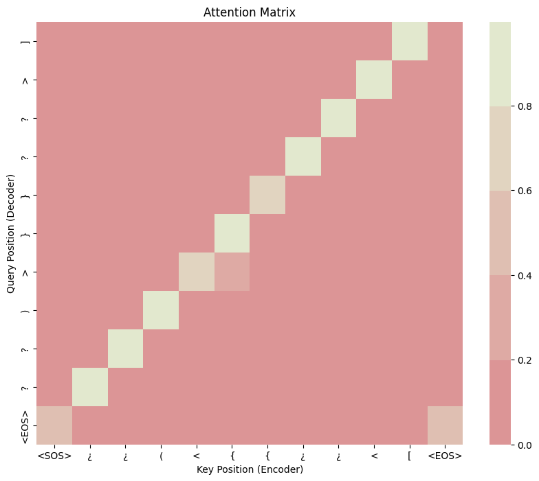

# Transformers Tiny Model 🤏


This project demonstrates the use of a tiny Transformer model to perform sequence-to-sequence (seq2seq) tasks on synthetic data. The model is trained to map input sequences of symbolic tokens to corresponding output sequences, learning to predict the correct transformation of the input sequence into the desired output.

## The Data


The dataset is synthetically generated and consists of pairs of input-output sequences of brackets. Each input sequence contains a series of opening brackets, and the corresponding output sequence contains the correct closing brackets in the right order.

Dataset Details:

- ``Input``: A sequence of opening brackets (e.g., ( [ { ¿).

- ``Output``: The corresponding sequence of closing brackets (e.g., ? ) ] }).

- ``Vocabulary``: Includes opening and closing brackets, as well as special tokens like <SOS>, <EOS> to indicate the Start and End Of the Sentence .

## Attention Mehanism


The model employs a self-attention mechanism to capture the relationships between different types of brackets, enabling it to generate the correct closing brackets for each opening bracket in the sequence. The attention mechanism allows the model to focus on different parts of the input sequence when generating the output sequence, making it more effective at capturing the dependencies between the brackets.

As expected, each tokens pays attention to the corresponding bracket in the input sequence.




## Usage


```bash

$ python bracket_generator.py  generator '¿ ¿ ( < { { ¿ ¿ < ['
Generated Output: <SOS> ] > ? ? } } > ) ? ? <EOS>

```

## Future Work

- [ ] Add variable lenght sequences


## Contributing

Contributions are welcome! Please feel free to submit a Pull Request. For major changes, please open an issue first to discuss what you would like to change.

- Fork the repository
- Create your feature branch (git checkout -b feature/AmazingFeature)
- Commit your changes (git commit -m 'Add some AmazingFeature')
- Push to the branch (git push origin feature/AmazingFeature)
- Open a Pull Request

Made with ❤️ by [Fer14]